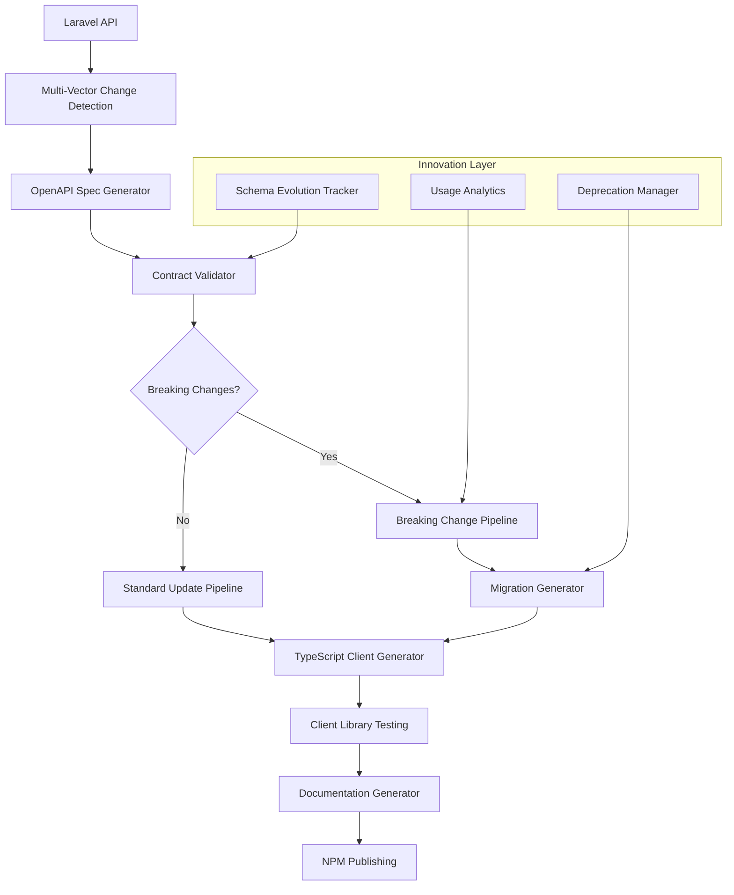

# Auto-Sync Architecture: Laravel API ↔ TypeScript Client

## 🎯 **Core Innovation: "Living API Contract" System**

Instead of traditional one-way generation, this implements a **bidirectional contract system** that:
- Detects breaking changes before they ship
- Auto-generates migration guides
- Provides backward compatibility layers
- Enables gradual TypeScript client updates

## 🏗️ **Architecture Overview**



## 🔄 **Tier 1: Laravel OpenAPI Generation**

### **Hybrid Generation Strategy**
```php
// config/scramble.php
return [
    'api_path' => 'api',
    'info' => [
        'version' => '1.0.0',
    ],
    // Auto-detect from Form Requests
    'use_form_request_rules' => true,
    // Custom extensions for complex cases
    'extensions' => [
        CustomAuthExtension::class,
        WizardStepExtension::class,
    ],
];
```

### **Smart Route Analysis**
```php
// app/Console/Commands/GenerateApiSpec.php
class GenerateApiSpec extends Command
{
    public function handle()
    {
        // 1. Generate base spec with Scramble
        $scrambleSpec = $this->generateScrambleSpec();
        
        // 2. Enhance with L5-Swagger annotations
        $enhancedSpec = $this->enhanceWithSwagger($scrambleSpec);
        
        // 3. Add custom metadata
        $finalSpec = $this->addCustomMetadata($enhancedSpec);
        
        // 4. Validate against previous version
        $this->validateBackwardCompatibility($finalSpec);
        
        return $finalSpec;
    }
}
```

## 🔍 **Tier 2: Multi-Vector Change Detection**

### **1. File System Watcher**
```php
// app/Services/ApiChangeDetector.php
class ApiChangeDetector
{
    public function watchForChanges(): void
    {
        $watcher = new FileWatcher([
            'app/Http/Controllers/Api',
            'app/Http/Requests',
            'app/Models',
            'routes/api.php',
        ]);
        
        $watcher->onChange(function ($files) {
            $this->analyzeChanges($files);
            $this->triggerRegeneration();
        });
    }
    
    private function analyzeChanges(array $files): array
    {
        return [
            'breaking_changes' => $this->detectBreakingChanges($files),
            'new_endpoints' => $this->detectNewEndpoints($files),
            'deprecated_fields' => $this->detectDeprecations($files),
        ];
    }
}
```

### **2. Git Hook Integration**
```bash
#!/bin/sh
# .git/hooks/pre-commit
echo "Checking API changes..."

# Generate new spec
php artisan api:generate-spec --temp

# Compare with committed spec
if php artisan api:compare-specs --temp; then
    echo "✅ No breaking changes detected"
else
    echo "⚠️  Breaking changes detected!"
    echo "Run: php artisan api:migration-guide"
    exit 1
fi
```

### **3. Schema Evolution Tracking**
```php
// database/migrations/create_api_evolution_table.php
Schema::create('api_evolution', function (Blueprint $table) {
    $table->id();
    $table->string('version');
    $table->json('spec_hash');
    $table->json('breaking_changes');
    $table->json('deprecations');
    $table->timestamp('deployed_at');
    $table->json('usage_metrics')->nullable();
});
```

## ⚡ **Tier 3: Intelligent Client Generation**

### **Progressive Enhancement Strategy**
```typescript
// scripts/generate-client.ts
interface GenerationStrategy {
  mode: 'safe' | 'progressive' | 'breaking';
  backwardCompatibility: boolean;
  generateMigrations: boolean;
}

class IntelligentClientGenerator {
  async generate(spec: OpenAPISpec, strategy: GenerationStrategy) {
    const changes = await this.analyzeChanges(spec);
    
    if (changes.hasBreaking && strategy.mode === 'safe') {
      return this.generateWithCompatibilityLayer(spec, changes);
    }
    
    if (strategy.generateMigrations) {
      await this.generateMigrationGuides(changes);
    }
    
    return this.generateClient(spec, strategy);
  }
  
  private async generateWithCompatibilityLayer(
    spec: OpenAPISpec, 
    changes: Changes
  ) {
    // Generate backward-compatible client with deprecation warnings
    const client = await this.baseGenerate(spec);
    const wrapper = this.createCompatibilityWrapper(changes);
    
    return this.mergeClientWithWrapper(client, wrapper);
  }
}
```

### **Smart Versioning System**
```typescript
// src/api/version-manager.ts
export class ApiVersionManager {
  private static readonly SUPPORTED_VERSIONS = ['1.0', '1.1', '2.0'] as const;
  
  static async migrateFromVersion(
    fromVersion: string, 
    toVersion: string
  ): Promise<MigrationPlan> {
    const migrations = await this.loadMigrations(fromVersion, toVersion);
    
    return {
      steps: migrations.map(m => ({
        description: m.description,
        codeChanges: m.generateCodeChanges(),
        automated: m.canAutomate(),
      })),
      breakingChanges: migrations.filter(m => m.isBreaking),
      estimatedEffort: this.calculateEffort(migrations),
    };
  }
}
```

## 📚 **Tier 4: Documentation Generation**

### **Multi-Format Documentation**
```typescript
// scripts/generate-docs.ts
class DocumentationGenerator {
  async generateAll(spec: OpenAPISpec) {
    return Promise.all([
      this.generateInteractiveDocs(spec),     // Redoc/Swagger UI
      this.generateTypeScriptDocs(spec),      // TypeDoc integration  
      this.generateMigrationGuides(spec),     // Version upgrade guides
      this.generateUsageExamples(spec),       // Auto-generated examples
      this.generateSDKReference(spec),        // Client library docs
    ]);
  }
  
  private async generateUsageExamples(spec: OpenAPISpec) {
    // Innovation: Auto-generate realistic examples from schema
    const exampleGenerator = new SmartExampleGenerator(spec);
    
    return {
      authentication: await exampleGenerator.generateAuthExamples(),
      crud: await exampleGenerator.generateCRUDExamples(),
      wizard: await exampleGenerator.generateWizardExamples(),
      errorHandling: await exampleGenerator.generateErrorExamples(),
    };
  }
}
```

## 🚀 **Innovation Features**

### **1. Predictive Breaking Change Analysis**
```php
// app/Services/BreakingChangePredictor.php
class BreakingChangePredictor
{
    public function analyzeProposedChanges(array $changes): PredictionReport
    {
        $usageData = $this->getUsageAnalytics();
        
        return new PredictionReport([
            'affectedClients' => $this->predictAffectedClients($changes, $usageData),
            'migrationComplexity' => $this->calculateMigrationComplexity($changes),
            'rollbackStrategy' => $this->generateRollbackStrategy($changes),
            'communicationPlan' => $this->generateCommunicationPlan($changes),
        ]);
    }
}
```

### **2. Usage-Driven Evolution**
```typescript
// src/api/usage-tracker.ts
export class UsageTracker {
  private static analytics = new Map<string, UsageStats>();
  
  static trackEndpointUsage(endpoint: string, method: string) {
    // Track which endpoints/fields are actually used
    // Helps identify safe deprecation candidates
  }
  
  static generateDeprecationReport(): DeprecationReport {
    return {
      safeToDeprecate: this.findUnusedEndpoints(),
      highImpactChanges: this.findHighUsageEndpoints(),
      migrationPriority: this.calculateMigrationPriority(),
    };
  }
}
```

### **3. Automated Integration Testing**
```typescript
// tests/integration/api-contract.test.ts
describe('API Contract Validation', () => {
  it('validates all endpoints match OpenAPI spec', async () => {
    const spec = await loadOpenAPISpec();
    const testSuite = generateContractTests(spec);
    
    for (const test of testSuite) {
      await validateEndpointContract(test);
    }
  });
  
  it('validates backward compatibility', async () => {
    const currentSpec = await loadOpenAPISpec();
    const previousSpec = await loadOpenAPISpec('previous');
    
    const compatibility = analyzeCompatibility(previousSpec, currentSpec);
    expect(compatibility.hasBreakingChanges).toBe(false);
  });
});
```

## 🔄 **Complete Automation Pipeline**

### **GitHub Actions Workflow**
```yaml
# .github/workflows/api-sync.yml
name: API Sync Pipeline

on:
  push:
    paths: 
      - 'app/Http/Controllers/Api/**'
      - 'app/Http/Requests/**'
      - 'routes/api.php'

jobs:
  detect-changes:
    runs-on: ubuntu-latest
    outputs:
      has-changes: ${{ steps.check.outputs.has-changes }}
      has-breaking: ${{ steps.check.outputs.has-breaking }}
    steps:
      - name: Check API Changes
        id: check
        run: |
          # Sophisticated change detection logic
          
  update-client:
    needs: detect-changes
    if: needs.detect-changes.outputs.has-changes == 'true'
    runs-on: ubuntu-latest
    steps:
      - name: Generate OpenAPI Spec
        run: php artisan api:generate-spec
        
      - name: Update TypeScript Client
        run: |
          cd typescript-client
          npm run generate
          npm run test
          
      - name: Generate Documentation
        run: npm run docs:generate
        
      - name: Create PR
        if: needs.detect-changes.outputs.has-breaking == 'true'
        uses: peter-evans/create-pull-request@v5
        with:
          title: "🚨 Breaking API Changes - Client Update Required"
          body: |
            ## Breaking Changes Detected
            
            ${{ steps.migration.outputs.breaking-changes }}
            
            ## Migration Guide
            
            ${{ steps.migration.outputs.migration-guide }}
            
      - name: Auto-merge Safe Changes
        if: needs.detect-changes.outputs.has-breaking == 'false'
        run: |
          npm version patch
          npm publish
```

This architecture provides:
- **🔄 Real-time sync** between Laravel API and TypeScript client
- **🛡️ Breaking change protection** with automated migration guides  
- **📈 Usage-driven evolution** based on actual client usage patterns
- **🤖 Intelligent automation** that adapts to your team's workflow
- **📚 Comprehensive documentation** that stays current automatically

The system is designed to evolve with your API, making maintenance virtually automatic while protecting your users from unexpected breaking changes.